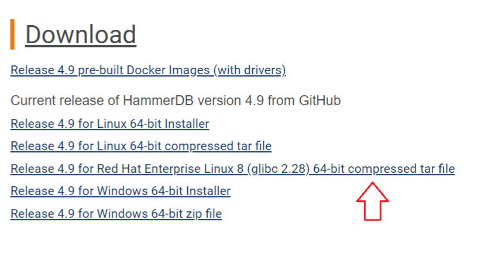

<p align="right">
<a href="#">  

</a>
</p>

<br/>

# HammerDB Installation


This repository is published in order to share how to Install HammerDB for Linux.
The official documentation can be found at <a href="https://www.hammerdb.com/document.html"> hammerdb.com </a>


## Download Binaries

Please download the binaries from official website https://www.hammerdb.com/download.html




## Installation

```
cd /your_path_to_binaries/file_name.tar.xz
```

```
tar -C /your_destination_directory/ -xvf file_name.tar.gz
```

you can rename the extracted folder using this command ( Optional )

```
 mv /your_path_to_file/old_name /your_path_to_new_file/new_name 
```


Check the installation :

```
/your_path_to_binaries/hammerdbcli
```


```
librarycheck
```


## Start HammerDB

The simple way for runing hammerdb is like this :

```
/your_path_binaries/hammerdb
```

## References

https://www.hammerdb.com/docs